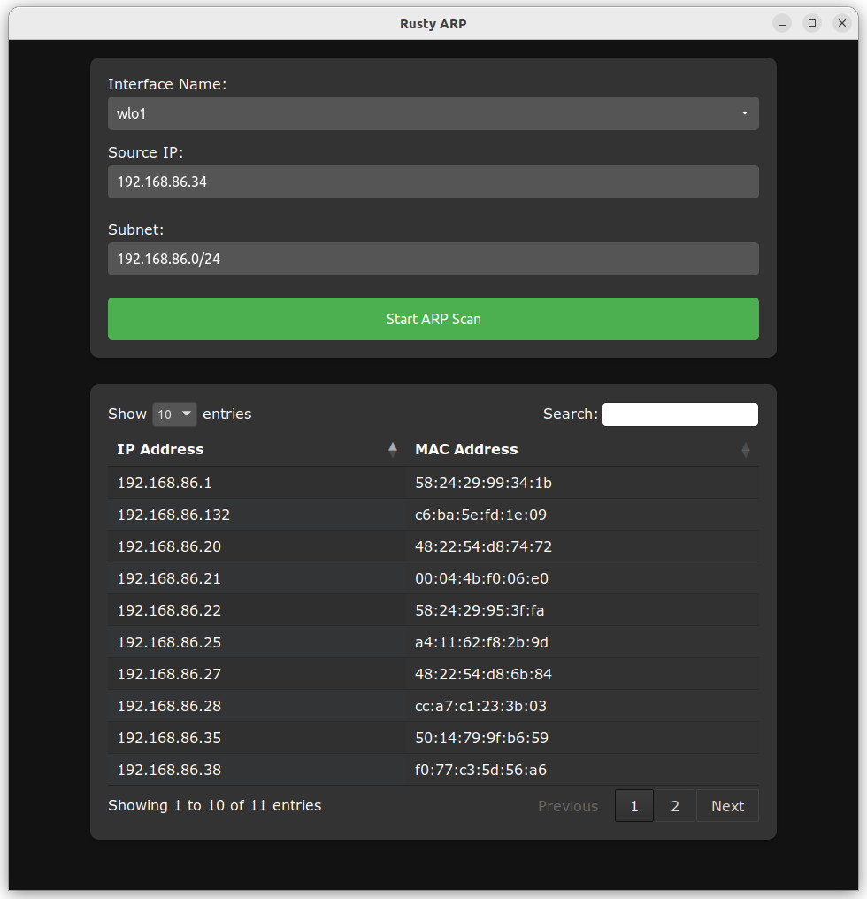
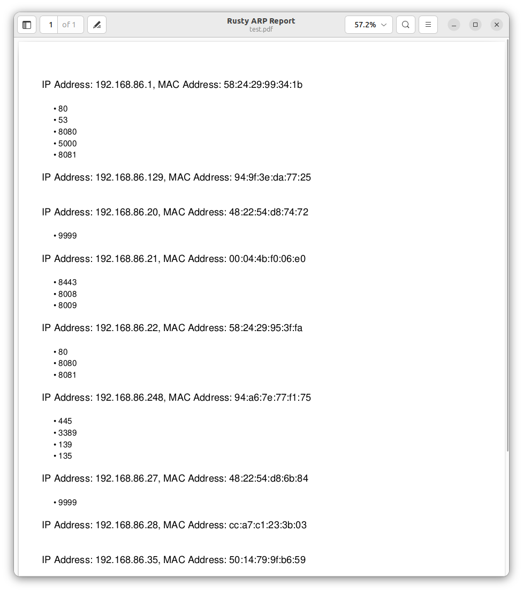

# ARP Scanner

ARP Scanner is a simple Rust application that scans a specified subnet for devices and retrieves their IP and MAC addresses using ARP requests. It utilizes the pnet and ipnetwork crates for networking functionality.

If you found this app useful 

    

### ToDO List
- [x] Add port scanning for each device 
- [x] Export scan results to report
- [ ] Add form validation

### Screenshots
 
